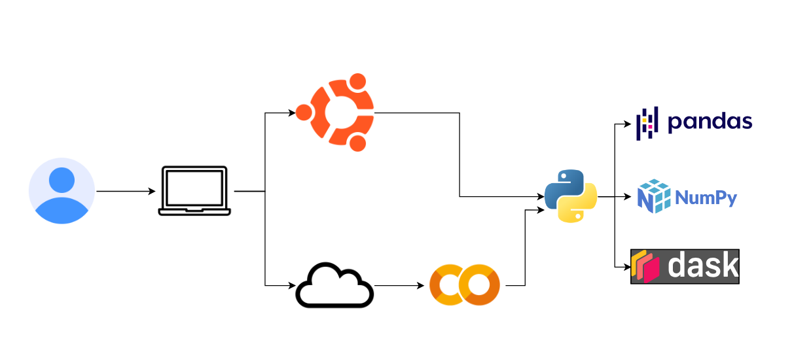
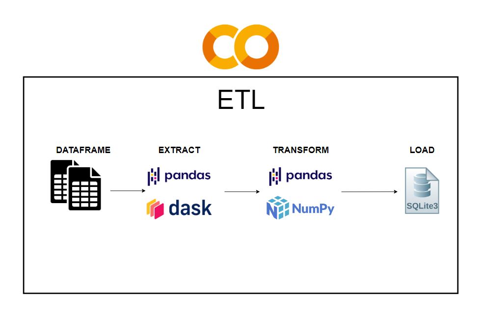

# Aprende a hacer Big Data sin gastar una fortuna: Python y Cloud
##### Por Santiago Sanchez Pulgarín

---

## Índice

1. Introducción
2. Los verdaderos requisitos minimos de hardware.
3. Herramientas de trabajo.
4. Ejercicio.
5. Conclusiones
6. Recursos adicionales

## 1. Introducción

Como desarrollador de software he tenido que enfrentarme a distintos retos a lo largo de mi carrera. El uso de Python como lenguaje de programación es cada vez más y más amplio, y sirve como base para desarrollo web, A.I, crypto, etc.

En este artículo, vamos a ahondar en **Big Data**, un término que, [según oracle](https://www.oracle.com/co/big-data/what-is-big-data/), abarca el fenómeno de "*los conjuntos de datos de mayor tamaño y más complejos*". En el desarrollo de software con Big data el volúmen de los datos y la velocidad de procesamiento son fundamentales, de estos dos considero que dependen gran parte del ciclo de vida de desarrollo y, debido a su naturaleza, es de esperar que estos procesos se realicen en equipos cuyo hardware permita el rapido y eficiente manejo de volumenes desde los miles, hasta los miles de millones de datos. 

Sin embargo, en pleno 2024 opino que las circunstancias han cambiado a favor de los desarrolladores, así que en este artículo te mostraré como puedes hacer Big data en una laptop barata (- $300 USD) utilizando herramientas de código abierto y técnicas de optimización.

## 2. Los verdaderos requisitos minimos de hardware.

Hewlett-Packard, también conocida como *[HP](https://es.wikipedia.org/wiki/Hewlett-Packard)*, es una compañia multinacional considerada de las lideres en tecnología y creación de equipos de computación. En [este post](https://www.hp.com/us-en/workstations/learning-hub/what-kind-computer-data-science.html) explican lo que, según ellos, son los **REQUISITOS MÍNIMOS QUE DEMANDA LA CIENCIA DE DATOS PARA HACER BIG DATA**. La lista de requerimientos que ellos comparten es clara:

- Min. 16GB de memoria RAM
- Una GPU con mínimo 4GB de memoria (hacen énfasis en el uso de NVIDIA como opción para las GPU)
- Procesador Intel® Core™ i7, i9, and Xeon®2, con mínimo 4 núcleos y una velocidad base de 2.0GHz
- Sistema operativo Windows 11 o Ubuntu

Sin embargo, no todo el mundo puede contar con un equipo así al alcance de la mano. En mi caso personal , desarrollo con una laptop **[ASUS Vivobook](https://www.ebay.com/itm/305360358598?itmmeta=01HQBT5X317B08S9CM047J68T4&hash=item4718e54cc6:g:YA4AAOSwVzNlqXaX&itmprp=enc%3AAQAIAAAA4DNjCQREvQgrTtZkyuf1NaGnuNkfeub7RnRM%2B0MQkHTbmZfLrOyX185AAwXVq6bb5ODX4IG%2FxRLAYMV%2FobfZqdb5WUdbTeY0aHyequ%2BCVddOrdBdWQH5wfG8efar%2FdiZuizhaYF4EMXDy9gpfyxtPCzsilX8h9rtgndCJDEUJAbSc4eEqx3m6vDgMUYtMGlcfBfETnORQ8QqhpatKEE3EYUQD%2BsyVvoCXHLdA4HUzM1e%2BEN6lTkCgWMxfjfu8lTAeAODQfjunZKBTxa8d%2FcoafwyJ1VMY%2FVb55s0BbirOBD4%7Ctkp%3ABk9SR8zRl_q6Yw)** que compré por **$295 USD**, la cual cuenta con: 

- 8GB de RAM
- Un procesador **Intel i5-1135G7** de 4 núcleos
- Una GPU integrada **Intel Iris Xe Graphics**. 

Así que en este artículo tomaremos estos requerimientos como los mínimos (e incluso veremos si podemos reducirlos todavía más) para el desarrollo de Big data.

## 3. Herramientas de trabajo.

Estas son las herramientas que vamos a usar:

- Pandas y NumPy
- Dask
- Google Colab

### Pandas y NumPy

Tanto [Pandas](https://pandas.pydata.org/pandas-docs/stable/index.html) como [NumPy](https://numpy.org/doc/stable/) son dos librerías de Python popularmente utilizadas en la ciencia de datos. Sirven para manipulación de datos y la computación científica respectivamente. Usaremos estas librerías debido a sus manejos eficientes para las estructuras de datos y los arrays multidimensionales que nos ayudarán a tratar con grandes cantidades de datos.

### Dask

[Dask](https://docs.dask.org/en/stable/) es una librería muy similar en su uso a Pandas y Numpy, con la diferencia que esta enfocada al procesamiento distribuido de datos a gran escala. La usaremos ya que nos interesa su eficiencia, siendo capaz de procesar grandes cantidades de conjuntos de datos.

### Google Colaboratory (Colab)

Para un ultimo caso de uso, usaremos el servicio de [Google Colaboratory](https://colab.research.google.com/) para ejecutar codigo python desde el navegador web. Lo usaremos por su capacidad de acceder de forma gratuita a GPUs y TPUs para el uso de las librerías antes mencionadas.

Finalmente, asi va a quedar nuestro entorno de trabajo:

## 4. Ejercicio.

Este será nuestro ejercicio:

